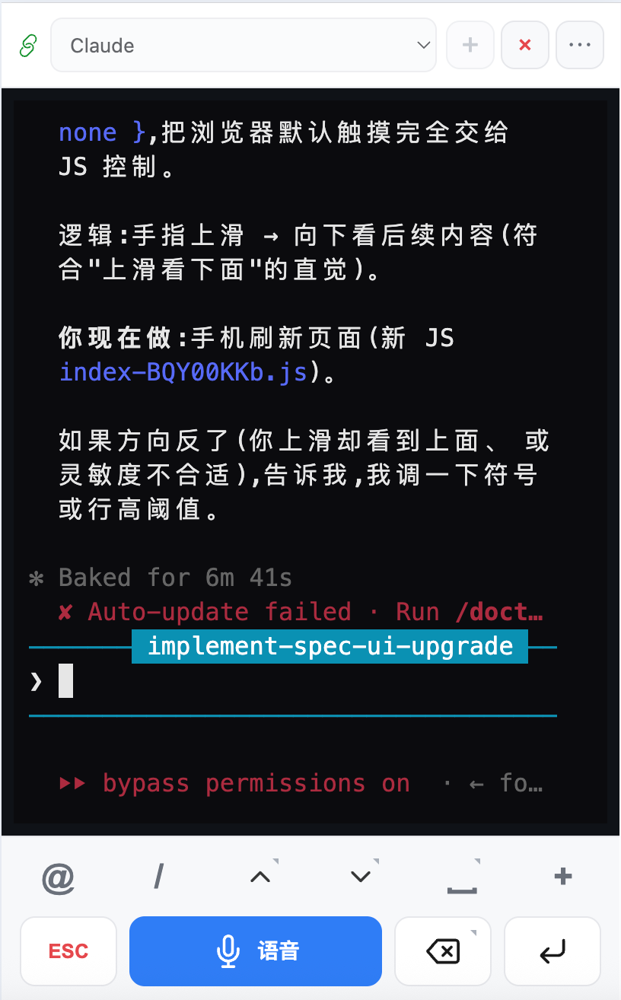
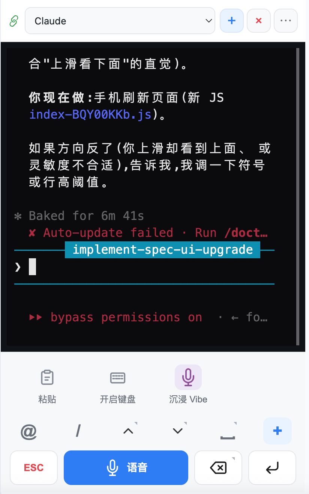
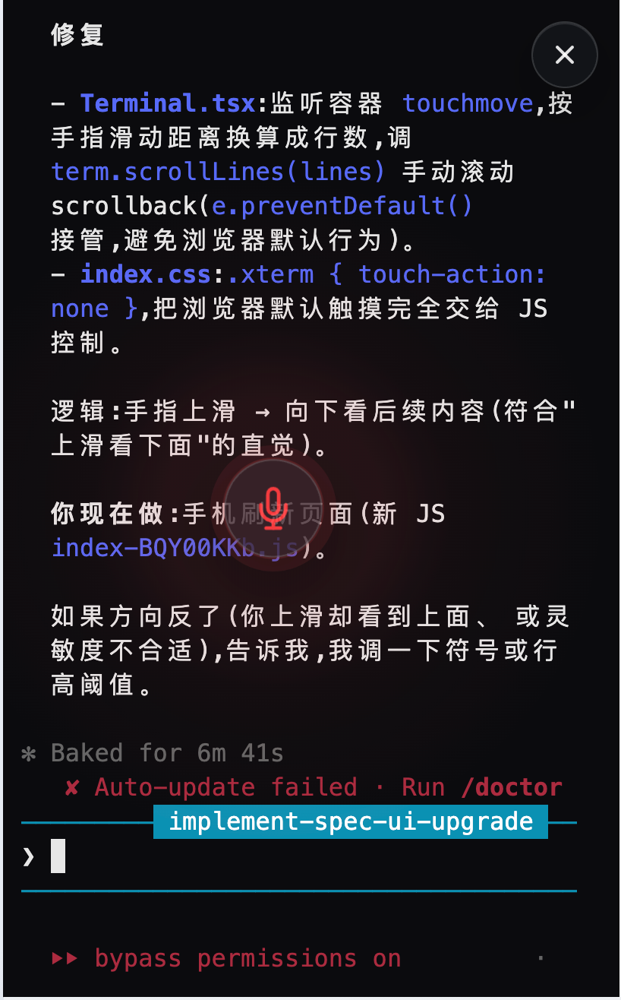
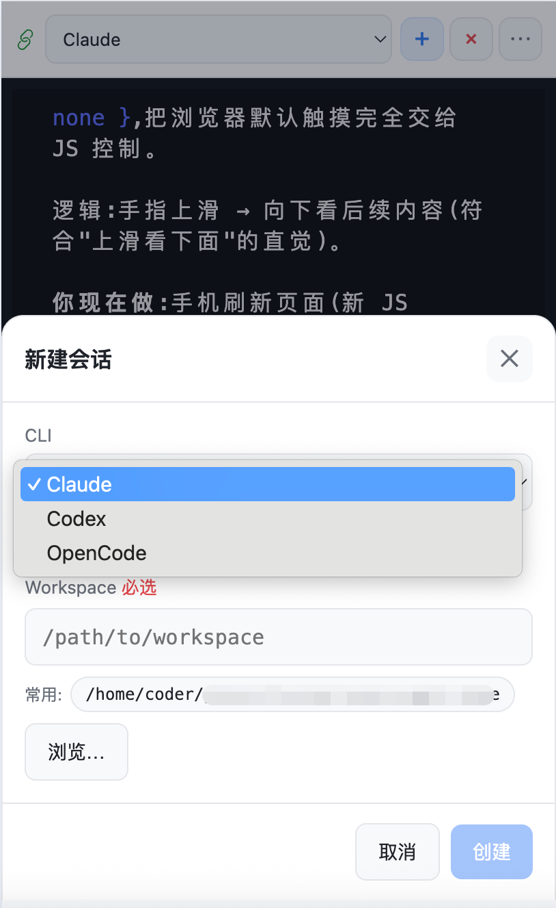
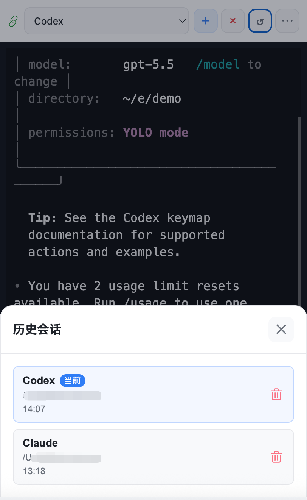
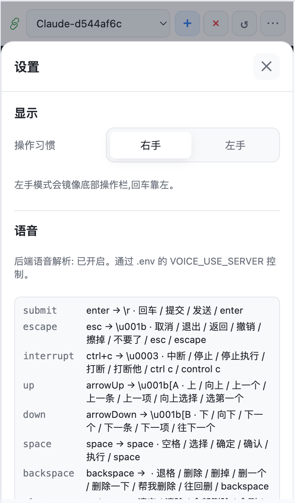

# Venus Vibe Deck

<p>
  <a href="./LICENSE"></a>
  
  
  
</p>

**把手机变成 AI 编程的语音优先控制台。**

Venus Vibe Deck 面向这样一类用户：AI 编程工具运行在真正的开发机器上，但你希望用手机或平板更轻松地操控它。

它提供可读的移动端终端、面向 coding agent 的个性化触控键盘、用于长指令的语音输入、全屏沉浸模式和多会话历史。它不绑定任何 AI 厂商：Claude Code、Codex、Gemini CLI、Aider、OpenCode、普通 `bash` 或任何能在终端里运行的命令都可以接入。

[English](./README.md) · 简体中文 · [详细使用说明](./docs/helps/user-guide.zh-CN.md)

## 一句话

AI 编程工具很强，但交互仍然高度依赖终端：确认、拒绝、上下移动、选择文件、粘贴上下文、继续会话、口述任务、等待完成。

Venus Vibe Deck 把 **工作台** 和 **控制面** 分开：

- 代码仓库、shell、凭证、MCP 服务和 AI Agent 留在服务器上。
- 手机变成语音、导航、确认、中断和会话切换的快速控制面板。
- 工作流保持工具中立，因为底层只是 PTY 的输入和输出。

## 特性

- **语音优先的编程输入**：不用和手机键盘较劲，直接口述长 prompt 或快捷命令；支持浏览器原生语音和服务端 ASR。
- **个性化 coding 键盘**：配置自己的 CLI，使用专门为 agent prompt 设计的触控键盘（支持语音识别）：方向键、Tab、Home/End、回车、Esc、退格、清除行、粘贴、键盘开关。
- **沉浸模式**：隐藏常规界面，终端全屏展示，通过长按语音手势驱动 Agent。
- **多会话支持**：在移动端创建、切换、关闭、重连和继续多个 PTY 会话。
- **编程工具中立**：支持任何终端 CLI，包括 Claude Code、Codex、Gemini CLI、Aider、OpenCode、自定义脚本和普通 shell。
- **理解工作流的历史会话**：按 CLI 类型 + workspace 记录历史，可连接在线会话，也可用 CLI 的 resume 参数重新继续。
- **Workspace 感知启动**：每个 session 都能在正确项目目录中启动，并带上保存的 CLI 参数。
- **云端或本地语音识别**：可用云端 realtime ASR，也可使用可选本地 `stt-server` 离线识别。
- **LLM 文本整理**：语音识别结果在进入终端前可被清洗，并匹配配置好的**语音命令**。
- **移动端可靠性细节**：重连恢复、scrollback 回放、触摸滚动、软键盘控制和 Web Push 通知。

## 工作流

```text
手机 / 平板浏览器
        |
        | 触控按键、语音输入、WebSocket
        v
Venus Vibe Deck server
        |
        | PTY stdin/stdout
        v
bash / Claude Code / Codex / 自定义 Agent CLI
```

## 界面

<p>
  
  
  
</p>

<p>
  
  
  
</p>

- **终端 HUD**：可读的服务端 PTY 输出，加上移动端 coding 控制面板。
- **更多面板**：粘贴、键盘开关和沉浸模式入口。
- **沉浸模式**：终端全屏展示，语音优先交互。
- **工具中立会话**：可为 Claude、Codex、OpenCode 或任意自定义 CLI 新建 session。
- **历史会话**：连接在线会话，或继续过去的 CLI + workspace 工作流。
- **设置面板**：切换左手/右手操作习惯，并查看语音命令配置摘要。

## 快速开始

```bash
npm install
npm run build
npm run start
```

默认监听 `0.0.0.0:8001`。

在同一局域网的移动设备上打开：

```text
http://<服务器局域网 IP>:8001
```

开发模式：

```bash
npm run dev
```

## 配置

复制 `.env.example` 为 `.env` 并按需调整。

| 变量 | 作用 | 默认值 |
|---|---|---|
| `HOST` | HTTP/WebSocket 监听地址 | `0.0.0.0` |
| `PORT` | HTTP/WebSocket 监听端口 | `8001` |
| `PTY_COMMAND` | 新建会话默认命令 | `bash` |
| `PTY_ARGS` | 默认命令参数 | 空 |
| `SCROLLBACK_BYTES` | 重连回放缓冲大小 | `51200` |
| `AUTH_ENABLED` | 是否启用访问密码验证 | `false` |
| `AUTH_PASSWORD` | 启用验证时使用的访问密码 | 空 |
| `AUTH_TTL_DAYS` | 登录有效期，单位天 | `7` |
| `AUTH_TOKEN_SECRET` | 认证 token 签名密钥，可选 | `AUTH_PASSWORD` |
| `VOICE_USE_SERVER` | 是否使用服务端语音识别 | `false` |
| `VOICE_ASR_PROVIDER` | `cloud` 或 `local` | `cloud` |
| `VENUS_DIR_ROOTS` | 目录浏览白名单 | home + cwd |
| `VENUS_DATA_DIR` | 运行时数据目录 | `~/.venus-vibe-deck` |

运行时数据：

```text
~/.venus-vibe-deck
```

## 文档

- [详细使用说明](./docs/helps/user-guide.zh-CN.md)
- [User Guide](./docs/helps/user-guide.md)
- [语音识别](./docs/stt.md)
- [文本转语音](./docs/tts.md)
- [Web Push 通知](./docs/web-push-notifications.md)
- [Session 生命周期](./docs/session-lifecycle.md)
- [前端交互规格](./docs/spec-ui.md)

## 仓库结构

```text
client/        React 移动端 UI
server/        Node.js HTTP、WebSocket、PTY、语音和存储服务
stt-server/    可选本地 Python STT 服务
docs/          规格和功能文档
docs/helps/    面向用户的使用说明
```

## 脚本

| 命令 | 说明 |
|---|---|
| `npm run dev` | server watch + client build watch |
| `npm run build` | 构建 server 和 client |
| `npm run start` | 启动编译后的 server |
| `./start.sh` | 后台构建并启动 |
| `./start.sh stop` | 停止后台服务 |
| `./start.sh log` | 查看服务日志 |

## 安全

Venus Vibe Deck 可以启动 shell 进程，并暴露目录浏览 API。默认应作为可信网络工具使用。

- 不要在没有鉴权和网络访问控制的情况下直接暴露到公网。
- 部署到共享机器前，请限制 `VENUS_DIR_ROOTS`。
- 不要提交 `.env`、API Key 或运行时数据。

## 作者

Kain

## License

[MIT](./LICENSE)
